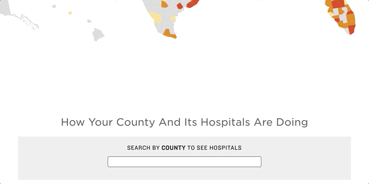

# NPR's Autocomplete widget

A text input that provides suggestions as you type. We've used it in a couple of our daily graphics, including our U.S. county-level maps on [COVID-19 hospital capacity](https://www.npr.org/sections/health-shots/2020/12/09/944379919/new-data-reveal-which-hospitals-are-dangerously-full-is-yours) and [flood damage](https://www.npr.org/2021/02/22/966428165/a-looming-disaster-new-data-reveal-where-flood-damage-is-an-existential-threat).



## Example Usage

First, install the package via `npm install @nprapps/autocomplete-input`.

```html
<body>
  <script type="module">
    import { AutocompleteInput } from "@nprapps/autocomplete-input";
  </script>

  <!-- Bind autocomplete-input to an existing datalist using its id -->
  <autocomplete-input list="pets"></autocomplete-input>
  <datalist id="pets">
    <option>Dog</option>
    <option>Cat</option>
    <option>Hamster</option>
    <option>Goldfish</option>
  </datalist>
</body>
```

## Building

This project is built using Rollup, which is included in the dev dependencies. By default, it's defined as a standard ES module, with `autocomplete-input.umd.js` providing a compatible wrapper for other module systems.

We do not include any polyfills with this class. If you need your tags to work in older browsers, you should probably include the [polyfills for custom elements and shadow DOM](https://github.com/webcomponents/polyfills/tree/master/packages/webcomponentsjs).
